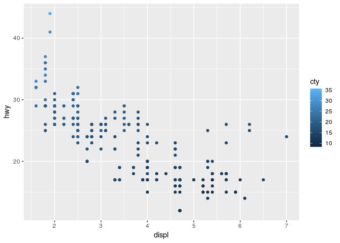
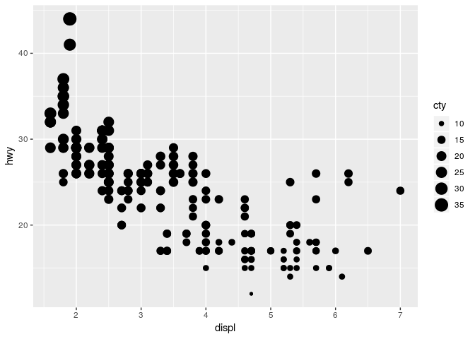
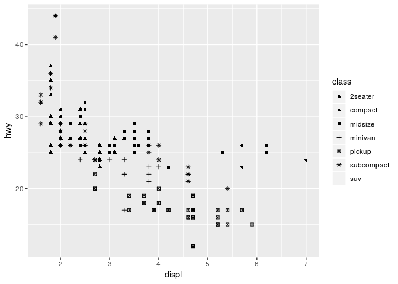
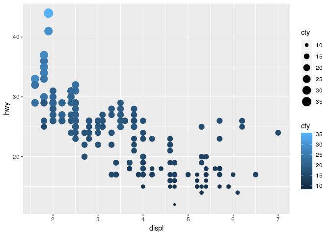
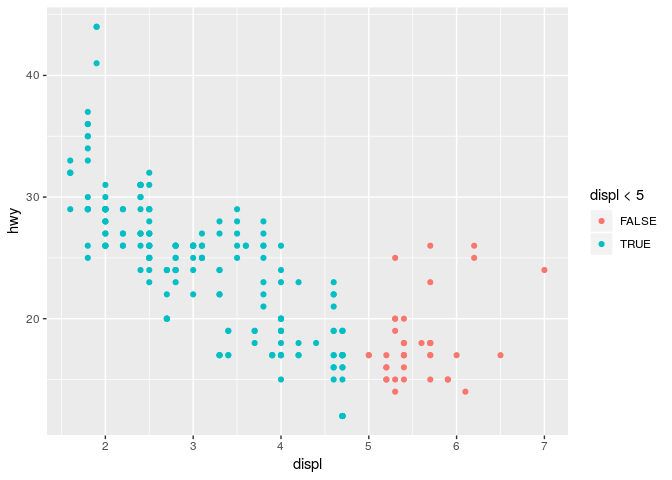

Homework 1: ggplot2
================
Piret Saar-Reismaa
2019-03-04

``` r
library(ggplot2)
```

By using *mpg* dataset:

1.  Map a continuous variable to color, size, and shape. How do these
    aesthetics behave differently for categorical vs. continuous
    variables?f

Some aesthetics work with both, some not, giving different aesthetics to
plotted points.

  - Color

<!-- end list -->

``` r
ggplot(data = mpg) +
  geom_point(mapping = aes(x = displ, y = hwy, color = cty))
```

<!-- -->

  - Size

<!-- end list -->

``` r
ggplot(data = mpg) +
  geom_point(mapping = aes(x = displ, y = hwy, size = cty))
```

<!-- -->

  - Shape

<!-- end list -->

``` r
ggplot(data = mpg) +
  geom_point(mapping = aes(x = displ, y = hwy, shape = class))
```

    ## Warning: The shape palette can deal with a maximum of 6 discrete values
    ## because more than 6 becomes difficult to discriminate; you have 7.
    ## Consider specifying shapes manually if you must have them.

    ## Warning: Removed 62 rows containing missing values (geom_point).

<!-- --> Shape can not
be mapped to a contiuos variable, it should have categorical values for
each to have a certain shape. It will give an Error.

2.  What happens if you map the same variable to multiple aesthetics?

<!-- end list -->

``` r
ggplot(data = mpg) +
  geom_point(mapping = aes(x = displ, y = hwy, color = cty, size = cty))
```

<!-- --> Additional
aesthetics can be used simultaniously to have one than more effect.

3.  What does the stroke aesthetic do? What shapes does it work with?
    (Hint: use ?geom\_point)

<!-- end list -->

``` r
ggplot(data = mpg) + 
  geom_point(mapping = aes(x = displ, y = hwy, shape = class), stroke=1, fill = "red", color = "green" )+
  scale_shape_manual(values = c(16:19, 21:24))
```

<!-- --> Stroke is used
for shapes that have a border that can be colored separately, then stroe
is used to modify the border width.

4.  What happens if you map an aesthetic to something other than a
    variable name, like aes(colour = displ \< 5)?

<!-- end list -->

``` r
ggplot(data = mpg) +
  geom_point(mapping = aes(x = displ, y = hwy, color = displ<5))
```

<!-- --> Then it will
differante between the given condition, so when displ is under 5
(displ\<5) it is true and one color, and if not then a different color.
